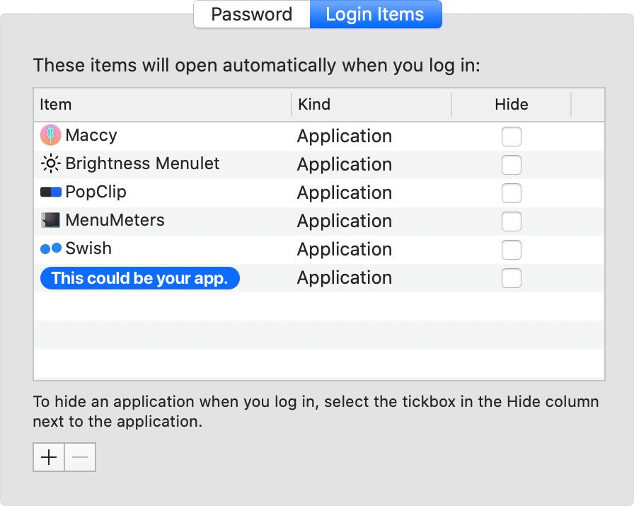

# LoginItemKit

A simple Swift package to add non-sandboxed macOS applications to user login items and to control their _Hide_ property.



## Overview

There are basically two ways to achieve _Launch at Login_ functionality on macOS.

Let's compare LoginItemKit to the popular [LaunchAtLogin](https://github.com/sindresorhus/LaunchAtLogin) package.

| []()                            | LaunchAtLogin                                                                                                  | LoginItemKit                                                                                                |
| :------------------------------ | :------------------------------------------------------------------------------------------------------------- | :---------------------------------------------------------------------------------------------------------- |
| Framework                       | [ServiceManagement](https://developer.apple.com/documentation/servicemanagement/1501557-smloginitemsetenabled) | [LaunchServices](https://developer.apple.com/documentation/coreservices/klssharedfilelistsessionloginitems) |
| Deprecated                      | [Partly](https://developer.apple.com/documentation/servicemanagement/1431086-smcopyalljobdictionaries) (10.10) | [Yes](https://developer.apple.com/documentation/coreservices/klssharedfilelistsessionloginitems) (10.11)    |
| Sandbox support                 | Yes                                                                                                            |  No                                                                                                         |
| SwiftPM support                 | [Yes](https://github.com/sindresorhus/LaunchAtLogin/issues/4)                                                  | Yes                                                                                                         |
| Needs helper app & build script | Yes                                                                                                            | No                                                                                                          |
| Shows up in system preferences  | [No](https://stackoverflow.com/a/15104481)                                                                     | Yes                                                                                                         |

So feel free to use this package in all your non-sandboxed apps and let's hope that Apple does not remove the LaunchServices API from future versions of macOS.

### The _Hide_ checkbox

Checking _Hide_ can cause problems for applications using high values for `NSWindow.Level`, e.g. the tooltip windows in [Swish](https://highlyopinionated.co/swish/). Version 2 of LoginItemKit allows you to read and write this property.

## Installation

#### SwiftPM

```swift
.package(url: "https://github.com/chrenn/LoginItemKit", from: "2.0.0")
```

## API

LoginItemKit exposes a tertiary `.launchState` enum for granular control as well as a simple `.launchAtLogin` boolean.

| []()                              | `launchState` | `launchAtLogin { get, set }` |
| :-------------------------------- | :------------ | :--------------------------- |
| Not in Login Items                | `.none`       | `false`, `false`             |
| In Login Items & _Hide_ checked   | `.hide`       | `true`, -                    |
| In Login Items & _Hide_ unchecked | `.show`       | `true`, `true`               |

### Usage

```swift
import LoginItemKit

print(LoginItemKit.launchState, LoginItemKit.launchAtLogin)
// → .none, false

LoginItemKit.launchAtLogin = true

print(LoginItemKit.launchState, LoginItemKit.launchAtLogin)
// → .show, true

LoginItemKit.launchState = .hide

print(LoginItemKit.launchState, LoginItemKit.launchAtLogin)
// → .hide, true

```

## Resources

- [LaunchAtLogin](https://github.com/sindresorhus/LaunchAtLogin)
- [LoginServiceKit](https://github.com/Clipy/LoginServiceKit)
- [HWSensors3](https://sourceforge.net/p/hwsensors/hwsensors3/code3/107/tree/trunk/hwmonitor2/HWMonitorSMC/RunAtLogin.swift#l4)
- [Marcos Crispino](https://stackoverflow.com/a/5598992)

## Used by

- [Swish](https://highlyopinionated.co/swish/)
