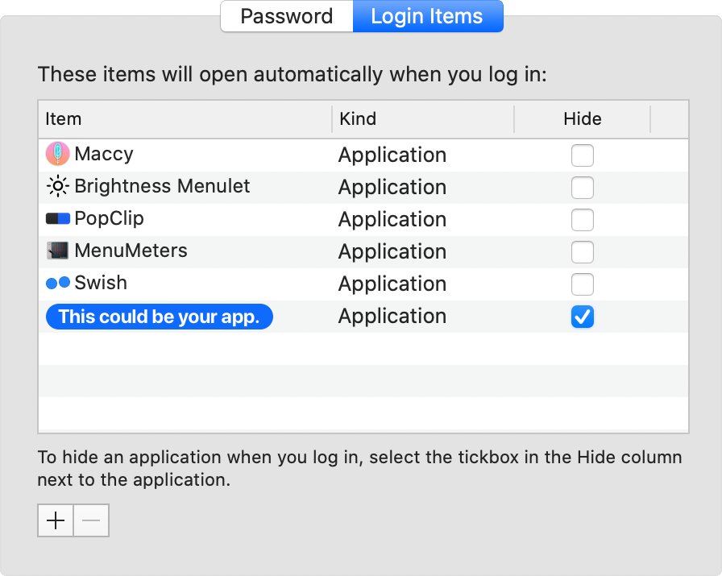

# LoginItemKit

A simple Swift package to add non-sandboxed macOS applications to user login items.



## Overview

There are basically two ways to achieve launch at login functionality on macOS.

Let's compare LoginItemKit to the popular [LaunchAtLogin](https://github.com/sindresorhus/LaunchAtLogin) package.

[]() | LaunchAtLogin | LoginItemKit
:--- | :--- | :---
Framework | [ServiceManagement](https://developer.apple.com/documentation/servicemanagement/1501557-smloginitemsetenabled) | [LaunchServices](https://developer.apple.com/documentation/coreservices/klssharedfilelistsessionloginitems)
Deprecated | [Partly](https://developer.apple.com/documentation/servicemanagement/1431086-smcopyalljobdictionaries) (10.10) | [Yes](https://developer.apple.com/documentation/coreservices/klssharedfilelistsessionloginitems) (10.11)
Sandbox support | Yes | No
SwiftPM support | [No](https://github.com/sindresorhus/LaunchAtLogin/issues/4) | Yes
Needs helper app & build script | Yes | No
Shows up in system preferences | [No](https://stackoverflow.com/a/15104481) | Yes

So feel free to use this package in all your non-sandboxed apps and let's hope that Apple does not remove the LaunchServices API from future versions of macOS.

## Installation

#### SwiftPM

```swift
.package(url: "https://github.com/chrenn/LoginItemKit", from: "1.0.0")
```

## Usage

```swift
import LoginItemKit

print(LoginItemKit.launchAtLogin)
// → false

LoginItemKit.launchAtLogin = true

print(LoginItemKit.launchAtLogin)
// → true
```

## Inspired by
- [LaunchAtLogin](https://github.com/sindresorhus/LaunchAtLogin)
- [LoginServiceKit](https://github.com/Clipy/LoginServiceKit)
- [HWSensors3](https://sourceforge.net/p/hwsensors/hwsensors3/code3/107/tree/trunk/hwmonitor2/HWMonitorSMC/RunAtLogin.swift#l4)
